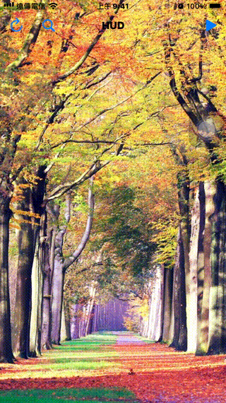

# WWHUD - Head Up Display

[](https://developer.apple.com/swift/) [](https://developer.apple.com/swift/)  [](https://developer.apple.com/swift/) [](https://developer.apple.com/swift/)

## [Introduction - 簡介](https://swiftpackageindex.com/William-Weng)
- [Custom read animation, support custom pictures, GIF animation.](https://youtu.be/6XVxvRKoAHM)
- [自定義讀取動畫，支援自定義圖片、GIF動畫。](https://youtu.be/6XVxvRKoAHM)



### [Installation with Swift Package Manager](https://medium.com/彼得潘的-swift-ios-app-開發問題解答集/使用-spm-安裝第三方套件-xcode-11-新功能-2c4ffcf85b4b)

```json
dependencies: [
    .package(url: "https://github.com/William-Weng/WWHUD.git", .upToNextMajor(from: "1.2.0"))
]
```

### Function - 可用函式|函式|功能|
|-|-|
|display(effect:height:backgroundColor:)|顯示HUD動畫|
|dismiss(animation:options:completion:)|移除HUD顯示|
|flash(effect:height:backgroundColor:animation:options:completion:)|顯示一段時間的HUD動畫，然後會移除|
|updateProgess(text:font:textColor:)|更新進度文字及字型|

### Example
```swift
import UIKit
import WWPrint
import WWHUD

final class ViewController: UIViewController {
    
    private var timer: CADisplayLink?
    private var percentage: Int = 0
    
    override func viewDidLoad() { super.viewDidLoad() }
}

private extension ViewController {
    
    @IBAction func displayHUD(_ sender: UIBarButtonItem) {
        
        let image = #imageLiteral(resourceName: "Crab")
        
        updateProgressPercentage(selector: #selector(updateProgressForHUD))
        WWHUD.shared.display(effect: .shake(image: image, angle: 10.0, duration: 1.0), height: 128, backgroundColor: .green.withAlphaComponent(0.3))
    }
    
    @IBAction func displayGifHUD(_ sender: UIBarButtonItem) {
        
        guard let gifUrl = Bundle.main.url(forResource: "SeeYou", withExtension: ".gif") else { return }
        
        updateProgressPercentage(selector: #selector(updateProgressForGifHUD))
        WWHUD.shared.display(effect: .gif(url: gifUrl, options: nil), height: 256.0, backgroundColor: .red.withAlphaComponent(0.3))
    }
    
    @IBAction func flashHUD(_ sender: UIBarButtonItem) {
        
        let image = #imageLiteral(resourceName: "White")
        
        WWHUD.shared.flash(effect: .indicator(image: image, count: 12, size: CGSize(width: 2.0, height: 20), duration: 1.0, backgroundColor: .purple), height: 64, backgroundColor: .green.withAlphaComponent(0.3), animation: 3.0) { postion in
            wwPrint(postion)
        }
    }
 
    @objc private func updateProgressForHUD(_ sender: CADisplayLink) {
        
        let percentageText = "\(percentage) %"
        
        WWHUD.shared.updateProgess(text: percentageText)
        percentage += 1
        
        if (percentage > 100) { dismissHUD() }
    }
    
    @objc private func updateProgressForGifHUD(_ sender: CADisplayLink) {
        
        var percentageText = "努力下載中…"
        var percentageTextColor: UIColor = .clear

        switch percentage {
        case ...30:
            percentageText = "努力下載中…"
            percentageTextColor = .red
        case 31...60:
            percentageText = "下載快一半…"
            percentageTextColor = .yellow
        case 61...90:
            percentageText = "就快下載完成了…"
            percentageTextColor = .green
        case 90...99:
            percentageText = "還差一點點…"
            percentageTextColor = .blue
        case 100...:
            percentageText = "終於下載完成了…"
            percentageTextColor = .white
            dismissHUD()
        default: percentageText = ""
        }
        
        percentage += 1
        WWHUD.shared.updateProgess(text: percentageText, textColor: percentageTextColor)
    }
}

private extension ViewController {
    
    func dismissHUD() {
        percentage = 0
        timer?.invalidate()
        timer = nil
        WWHUD.shared.dismiss { _ in WWHUD.shared.updateProgess(text: nil) }
    }
    
    func updateProgressPercentage(selector: Selector) {
        timer?.invalidate()
        timer = nil
        timer = CADisplayLink(target: self, selector: selector)
        timer?.preferredFramesPerSecond = 24
        timer?._fire()
    }
}
```


